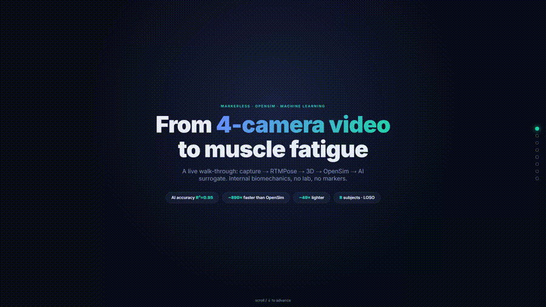
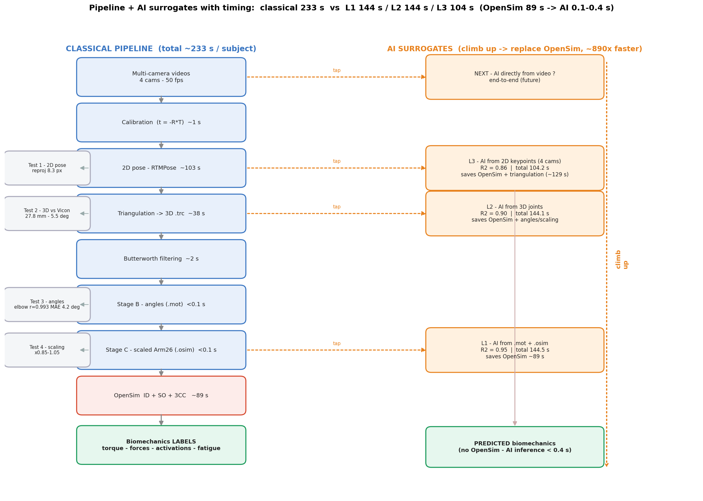

<h1 align="center">Vision-Based Optical Simulation</h1>
<h3 align="center">Muscle Fatigue & Biomechanical Variable Prediction from Markerless Video</h3>

<p align="center">
  
  
  
  
  
  
  
</p>

---

## 📝 Abstract

Estimating internal biomechanical variables and muscle fatigue from visual observations remains
a significant challenge in biomechanics, rehabilitation, and sports science. Conventional
approaches rely on wearable sensors such as electromyography (EMG), inertial measurement
units (IMUs), or motion-capture systems, which are often expensive, intrusive, and difficult to
deploy outside controlled laboratory environments.

This work presents a **vision-based musculoskeletal simulation framework** for predicting
biomechanical variables and muscle fatigue from ordinary RGB videos. The proposed approach
combines pose estimation, biomechanical modeling, and physics-based simulation within a
unified pipeline. Human motion is first captured using a standard monocular camera and
processed to extract body keypoints. Kinematic features are then reconstructed and integrated
into an **OpenSim** musculoskeletal model to estimate joint torques, muscle activations, and muscle
forces. A **three-compartment fatigue model** is subsequently employed to characterize muscle
fatigue dynamics during exercise.

A case study involving **biceps curl** exercises is conducted to generate a physics-informed dataset
linking visual observations to internal biomechanical states. Experimental results demonstrate
that vision-derived kinematic measurements can accurately reproduce biomechanical quantities
of interest while providing meaningful estimates of muscle activation and fatigue progression.
The proposed framework enables non-contact biomechanical monitoring and creates a
foundation for future **artificial intelligence models** capable of directly predicting internal
biomechanical variables from video data.

The proposed methodology offers a low-cost, scalable, and practical solution for applications in
rehabilitation, ergonomics, sports performance assessment, and remote healthcare monitoring.

> **Keywords:** Vision-Based Biomechanics, Muscle Fatigue, OpenSim, Pose Estimation,
> Musculoskeletal Modeling, Artificial Intelligence, Human Motion Analysis

---

## 🎬 Demo

<p align="center">
  <video src="https://idriss-jedid.github.io/Vision-Based-Optical-Simulation-for-Muscle-Fatigue-and-Biomechanical-Variable-Prediction/demo.mp4" controls muted loop width="860" poster="media/banner.gif"></video>
</p>

<p align="center">
  <b>▶ <a href="https://idriss-jedid.github.io/Vision-Based-Optical-Simulation-for-Muscle-Fatigue-and-Biomechanical-Variable-Prediction/">Live demo page</a></b>
  &nbsp;·&nbsp; <a href="media/demo.mp4">download the video</a>
</p>

<p align="center"><em>2-minute walk-through: capture → RTMPose → 3D triangulation → OpenSim Arm26 → AI surrogate.</em></p>

<p align="center"></p>

<p align="center"></p>

---

## 📊 Dataset — Fit3D

We build on the public **Fit3D** dataset: **https://fit3d.imar.ro/fit3d**

Fit3D is a large-scale dataset for **3D human pose and shape estimation during fitness training**.
It contains repetitions of common gym exercises recorded simultaneously by **multiple synchronized,
calibrated RGB cameras**, together with **Vicon marker-based 3D ground truth** and camera calibration
parameters. This combination of *multi-view video + lab-grade ground truth* is exactly what a
markerless biomechanics pipeline needs: video to drive the pipeline, and Vicon to validate it.

**How we use it in this project:**

| What we take from Fit3D | How it is used here |
|---|---|
| The **`dumbbell_biceps_curls`** exercise, 4 calibrated camera views, 50 fps | the only sensor input to the whole pipeline |
| **8 subjects** (s03 … s11) | one model per subject + **leave-one-subject-out** validation |
| **Camera calibration parameters** | converted to the Pose2Sim `Calib.toml` convention (`t = −R·T`) |
| **Vicon 3D ground truth** | validates the triangulated 3D joints (27.8 mm) and elbow angle (r = 0.99) |

> We do **not** redistribute Fit3D media. The raw videos and the per-frame 2D keypoints are
> regenerated locally from Fit3D; only the lightweight derived data (3D `.trc`, motions, calibrations,
> scaled models, datasets, metrics) is committed here. Download the videos from the link above.

---

## 🔬 Methodology — how it was built, step by step

The system is a single pipeline that turns multi-camera video into internal biomechanics, and then
learns to shortcut the expensive physics with machine learning.

### Stage 1 — Markerless motion capture (Pose2Sim)

1. **Calibration.** The Fit3D camera parameters are converted into a Pose2Sim `Calib.toml`. The crucial
   detail is the translation convention: Pose2Sim expects the OpenCV extrinsic `tvec`, i.e.
   **`translation = −R·T`** (not the camera centre `T`). Getting this right took the elbow-angle
   correlation from ~0.86 to **0.99** — it is the single most important fix in the whole pipeline.
2. **2D pose estimation.** Each frame of each of the 4 views is processed by **RTMPose** (HALPE-26),
   giving 26 body keypoints with confidence scores (~103 s per subject).
3. **Triangulation.** The 4 views are fused by confidence-weighted multi-view triangulation into 3D
   joint trajectories (`.trc`). Mean reprojection error ≈ 8.3 px; 3D error vs Vicon ≈ 27.8 mm.
4. **Filtering.** The 3D trajectories are smoothed with a **zero-phase Butterworth low-pass (2 Hz,
   `filtfilt`)** before any differentiation — this is what makes the joint *accelerations* clean enough
   to trust, and is the key lever for accurate inverse dynamics.

### Stage 2 — Biomechanical simulation (OpenSim Arm26)

5. **Subject-specific scaling.** The generic **Arm26** model (2 DOF: shoulder + elbow; 7 Hill-type
   muscles: TRIlong, TRIlat, TRImed, BIClong, BICshort, BRA, BRD) is scaled by each subject's measured
   segment lengths. A 2 kg load is rigidly attached to the hand to reproduce the curl.
6. **Inverse Dynamics (ID).** From the reconstructed joint angles → **joint torque**
   (`τ = M(q)q̈ + C(q,q̇)q̇ + G(q)`).
7. **Static Optimization (SO).** Torque is distributed across muscles by minimising effort
   (`min Σ aₘ²` s.t. `Σ rₘ(q)·Fₘ = τ`) → **muscle forces** and **activations**.
8. **Three-Compartment fatigue (3CC).** Activations drive a 3-compartment controller
   (`dMF/dt = F·MA − R·MF`) that tracks the fraction of fatigued motor units over time → **muscle
   fatigue**.

This stage turns one curl into four time-resolved signals per frame: **joint torque, muscle
activations, muscle forces, and muscle fatigue** — the *labels* for the learning stage.

### Stage 3 — AI surrogate (replace the physics)

9. **Feature engineering + learning.** A **LightGBM** gradient-boosting model is trained to predict the
   13 biomechanical targets directly from kinematic features (angles / velocities / accelerations and
   cumulative "memory" features that capture fatigue history). Hyper-parameters are tuned with
   **Optuna** (TPE + Hyperband) and the model is explained with **SHAP**.
10. **Validation.** **Leave-one-subject-out** cross-validation over the 8 subjects. The surrogate
    reaches **R² = 0.95**, runs in **~0.1 s** (vs ~89 s for OpenSim, **~890× faster**) from a single
    **21 MB** file (**~49× lighter** than the OpenSim + SimTK + Geometry stack).

### Where to tap the pipeline — three approaches

| Approach | Input | Accuracy (R²) | End-to-end | AI inference | Model |
|----------|-------|:---:|:---:|:---:|:---:|
| **A — `.mot + .osim`** | cleaned angles + scaled model | **0.952** | 144.5 s | 0.36 s | 21 MB |
| **B — 3D joints** | 3 triangulated 3D joints | **0.904** | 144.1 s | 0.10 s | 21 MB |
| **C — 2D keypoints** | raw 2D keypoints (4 cams) | **0.860** | 104.2 s | 0.17 s | 21 MB |

The earlier the AI taps the pipeline, the less pre-processing it needs, at a small accuracy cost.
On a held-out subject it reproduces torque (R² 0.90), activation (0.88), force (0.87) and fatigue
(0.94). All result figures are in [`figures/`](figures).

---

## 📂 Repository structure

```
.
├── src/
│   ├── pipeline/              # Vision → biomechanics
│   │   ├── run_stage2_pipeline.py   #   3D .trc → Arm26 → ID / SO / 3CC
│   │   ├── build_arm26_model.py     #   build the loaded Arm26 model (2 kg curl)
│   │   ├── scale_from_trc.py        #   subject-specific scaling
│   │   ├── batch_all_subjects.py · batch_calib_all.py · build_calib_world.py
│   │   ├── extract_labels_all.py    #   OpenSim labels for the 8 subjects
│   │   └── run_id_so.py · run_fatigue_so.py
│   ├── ml/                   # The three AI surrogates
│   │   ├── train_approach_A.py      #   A · from .mot + .osim
│   │   ├── train_approach_B_3d.py   #   B · from 3D joints
│   │   ├── train_approach_C_2d.py   #   C · from 2D keypoints
│   │   └── benchmarks_tabular.py · benchmarks_deep.py
│   └── viz/                  # Figures + timing / memory analysis
│       ├── make_pipeline_figure.py · make_timing_figures.py
│       ├── make_timing_levels.py · make_resources_figure.py
│       └── timing_compare.py · memory_compare.py
├── models/                    # Trained surrogates + the Arm26 model
│   ├── approach_A_mot_osim/ · approach_B_3d/ · approach_C_2d/   # LightGBM .joblib + cards
│   └── arm26/                #   arm26_loaded.osim · arm26_base.osim · HOW_IT_WORKS.md
├── dataset/                   # ML datasets + metrics
│   ├── ml_dataset_A.csv · ml_dataset_3D.csv · ml_dataset_3D_RAW.csv
│   └── metrics_*.csv · MASTER_comparison.csv · timing_pipeline.csv
├── figures/                   # All result figures (pipeline, timing, XAI, per-muscle, …)
├── media/                     # demo video + preview GIF
└── media/                     # demo video + preview GIF
```

---

## 🚀 Reproduce

```bash
# 1. environment (OpenSim + ML)
conda create -n biomech python=3.10 && conda activate biomech
pip install opensim pose2sim lightgbm optuna shap scikit-learn pandas matplotlib

# 2. download the Fit3D videos -> https://fit3d.imar.ro/fit3d
# 3. vision → biomechanics labels (per subject)
python src/pipeline/run_stage2_pipeline.py
python src/pipeline/extract_labels_all.py

# 4. train a surrogate (Approach B, 3D joints) + benchmarks
python src/ml/train_approach_B_3d.py
python src/ml/benchmarks_tabular.py
python src/viz/timing_compare.py && python src/viz/memory_compare.py
```

Using a trained model:
```python
import joblib
m = joblib.load("models/approach_B_3d/lgbm_3d_vision.joblib")
y = m["y_scaler"].inverse_transform(m["model"].predict(m["x_scaler"].transform(X)))
# y -> [elbow torque, 4× activation, 4× force, 4× fatigue]
```

---

## 📦 What is and isn't in the repo

**Included** — the essential code (`src/`), the three trained surrogates and the Arm26 model
(`models/`), the ML datasets and metrics (`dataset/`), all result figures (`figures/`) and the demo
video (`media/`).

**Not included** — raw camera videos and per-frame 2D keypoints (regenerated by RTMPose from the
**Fit3D** videos), the OpenSim `Geometry/` meshes, and exploratory / one-off scripts and intermediate
per-subject outputs kept out to keep the repository lean.

---

## 🛠️ Tech stack

**Vision** Pose2Sim · RTMPose (HALPE-26) · OpenCV calibration &nbsp;|&nbsp;
**Biomechanics** OpenSim · Arm26 · Inverse Dynamics · Static Optimization · 3-Compartment fatigue &nbsp;|&nbsp;
**ML** LightGBM · Optuna (TPE / Hyperband) · SHAP · scikit-learn (LOSO CV)

---

Built on the public **Fit3D** dataset ([fit3d.imar.ro/fit3d](https://fit3d.imar.ro/fit3d)); the Arm26
musculoskeletal model ships with **OpenSim**.

**Authors** — Idriss Jedid · Jinan Charafeddine · Abderraouf Benali
