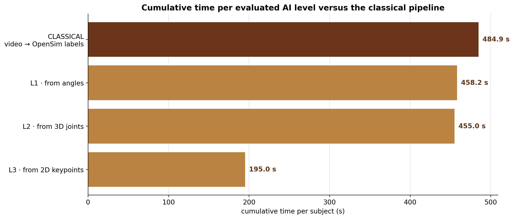
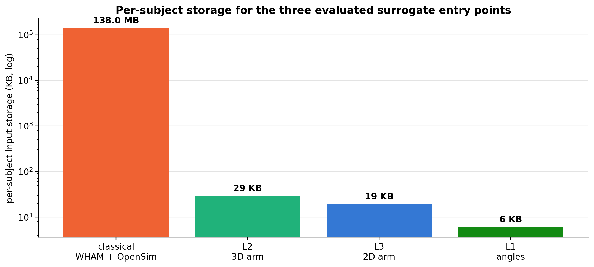

<h1 align="center">Vision-Based Optical Simulation</h1>
<h3 align="center">Upper-limb muscle forces and fatigue from markerless video</h3>

  <b><a href="https://idriss-jedid.github.io/Vision-Based-Optical-Simulation-for-Muscle-Fatigue-and-Biomechanical-Variable-Prediction/">Project page</a></b>
  &nbsp;·&nbsp; <a href="media/demo.mp4">Narrated demo</a>
  &nbsp;·&nbsp; <a href="https://fit3d.imar.ro/fit3d">Fit3D</a>
  &nbsp;·&nbsp; <a href="https://zenodo.org/records/7607736">MM-Fit</a>

  <video src="https://idriss-jedid.github.io/Vision-Based-Optical-Simulation-for-Muscle-Fatigue-and-Biomechanical-Variable-Prediction/demo.mp4" controls width="860" poster="media/banner.gif"></video>

## Abstract

Muscle activation, force and fatigue are central to rehabilitation, yet they are usually measured
with electromyography, force sensors or marker-based motion capture: equipment that is costly,
intrusive and confined to the laboratory. An ordinary RGB camera, by contrast, is available
everywhere, but it only records how a limb moves, not how its muscles work.

This work presents a vision-based framework that estimates the internal biomechanics of the upper
limb from markerless RGB video, demonstrated on the dumbbell biceps curl. Two routes recover the
motion of the arm. The multi-camera route extends Pose2Sim: RTMPose detects 2D keypoints in four
calibrated views, which are triangulated into 3D joints. The single-camera route extends OpenCap
Monocular: ViTPose and WHAM estimate the 3D body from a single video, which is then aligned with
gravity and filtered. In both routes, the shoulder, elbow and wrist give the two joint angles of the
arm. Validated against Vicon motion capture, the elbow angle follows the reference with a correlation of
0.993 in both routes, with a mean error of 6.6° with four cameras and 6.94° with one camera.

The recovered motion drives a subject-scaled OpenSim Arm26 musculoskeletal model carrying a 2 kg
dumbbell. Inverse dynamics, static optimisation and a three-compartment fatigue model produce
thirteen time-resolved signals: the elbow torque and the activation, force and fatigue of the four
elbow flexors (biceps long and short heads, brachialis and brachioradialis).

Because this physics-based pipeline takes several minutes per recording, machine-learning surrogates
are trained to reproduce its outputs directly. With four cameras, LightGBM reaches R² = 0.952
against OpenSim. With a single camera, a bidirectional GRU predicts the thirteen signals from 2D
keypoints alone with R² = 0.938 on unseen subjects, about 1,680 times faster than the OpenSim solve
and without a GPU.

This model is integrated into a web and mobile application: the patient records an exercise at home
with a phone camera, and the clinician reviews the resulting muscle signals remotely. The framework
offers a low-cost, non-contact way to monitor muscle effort and fatigue in rehabilitation. Data are
drawn from the Fit3D and MM-Fit datasets.

**Keywords:** RGB camera · markerless motion capture · human pose estimation · 3D reconstruction · musculoskeletal modelling · OpenSim · muscle activation · muscle force · muscle fatigue · surrogate model · deep learning · tele-rehabilitation

---

## Contents

1. [Overview](#1-overview)
2. [Building the two pipelines](#2-building-the-two-pipelines)
3. [Validation against Vicon](#3-validation-against-vicon)
4. [Biomechanical outputs](#4-biomechanical-outputs)
5. [Why an AI surrogate](#5-why-an-ai-surrogate)
6. [AI surrogate: three approaches, benchmark and fine-tuning](#6-ai-surrogate-three-approaches-benchmark-and-fine-tuning)
7. [Optimisation, ONNX export and deployment](#7-optimisation-onnx-export-and-deployment)
8. [Datasets](#8-datasets)

---

## 1. Overview

Two pipelines take a video of a biceps curl all the way to the muscle signals, one with **four
cameras** and one with a **single camera**. Neither was built from scratch: both start from an
existing open-source architecture, which was adapted to the upper limb and extended with new layers.

| Step | What was done |
|---|---|
| **Architectures** | took Pose2Sim (4 cameras) and OpenCap Monocular (1 camera), and changed them for an arm task |
| **Musculoskeletal model** | took OpenSim Arm26, and changed it for a loaded curl |
| **Validation** | tested each stage of both pipelines against Vicon motion capture |
| **Outputs** | extracted elbow torque and muscle activation, force and fatigue (3CC) |
| **AI** | replaced the slow pipeline with a learned surrogate: 3 input approaches, model benchmark, fine-tuning |
| **Deployment** | optimised the chosen model, exported it to ONNX, and deployed it in a web and mobile app |

---

## 2. Building the two pipelines

### 2.1 Four cameras — from Pose2Sim

Pose2Sim's 2D pose estimation (RTMPose), triangulation and filtering are kept. Its calibration is
replaced by a conversion of the Fit3D camera parameters, where the translation must be `−R·T`; this
fix alone raised the elbow-angle correlation from 0.86 to 0.99. Its full-body marker augmentation and
inverse kinematics are replaced by three joint centres (shoulder, elbow, wrist) and two analytical
joint angles.

### 2.2 One camera — from OpenCap Monocular

OpenCap Monocular's ViTPose and WHAM stages are kept. Its two-stage optimisation, designed for walking
(feet, floor, ground contact), is replaced by aligning the torso with gravity and a zero-phase 2 Hz
filter; its 38 markers and 33-DOF body by three joint centres and a 2-DOF arm. The shoulder centre is
taken between WHAM's two joint regressors, which err in opposite directions.

### 2.3 Musculoskeletal model — from OpenSim Arm26

The 2-DOF Arm26 model receives a 2 kg dumbbell welded to the hand and is scaled to each subject.
Eleven muscle paths were tested; static optimisation shows that four flexors carry the load
(brachialis 41.7 %, biceps long head 39.9 %, short head 11.5 %, brachioradialis 6.9 %), so these four
are kept.

---

## 3. Validation against Vicon

Each stage was tested on Fit3D (8 subjects) against Vicon motion capture, with thresholds fixed
before measuring. Both pipelines pass every test.

| Test | Four cameras | One camera | Limit |
|---|:---:|:---:|:---:|
| T1 · 2D pose — reprojection error | 8.3 px | 7.7 px | < 15 px |
| T2 · 3D joints — position / arm direction | 27.5 mm / 6.7° | 49.4 mm / 6.6° | < 60 mm |
| T3 · Elbow angle — correlation / MAE | 0.993 / 6.6° | 0.993 / 6.94° | > 0.90 / < 10° |
| T4 · Segment scaling — humerus / forearm | ×0.934 / ×0.959 | ×0.943 / ×1.017 | 0.85 – 1.15 |

With four cameras, the per-subject reprojection error ranges from 5.0 px (s04) to 13.5 px (s08) and the
3D error from 20.6 mm (s11) to 38.2 mm (s08); the elbow-angle correlation stays above 0.99 for every
subject. The measured segment lengths personalise the Arm26 model (default humerus 0.291 m, forearm
0.254 m).

  
  

<em>Left: single-camera tests per subject. Right: the reconstructed skeleton laid back over a camera view in Blender.</em>

---

## 4. Biomechanical outputs

From the validated motion, OpenSim computes the internal biomechanics frame by frame:

| Solver | Output |
|---|---|
| Inverse dynamics | elbow torque |
| Static optimisation | activation and force of the 4 flexors |
| Three-compartment fatigue model (3CC) | fatigue of the 4 flexors |

This gives **13 time-resolved signals** per recording. The 3CC model (Xia & Frey-Law) uses elbow rates
and is coupled to static optimisation, so a tiring muscle passes load to the others; fatigue grows with
load and repetitions as expected (2.7 % to 28.5 % across four conditions).

---

## 5. Why an AI surrogate

The pipeline is accurate but heavy. On a single camera, one 35-second recording takes **485 s**
(14× real time), needs a **GPU**, and stores a 137 MB WHAM output plus a 624 MB OpenSim installation.

| Stage (one camera) | Time | Share |
|---|:---:|:---:|
| 2D pose (ViTPose) | 195 s | 40.2 % |
| 3D pose (WHAM) | 260 s | 53.6 % |
| Gravity alignment + filtering | 3 s | 0.6 % |
| Angles + scaling | 0.2 s | < 0.1 % |
| OpenSim (ID + SO + 3CC) | 26.7 s | 5.5 % |
| **Total** | **485 s** | |

That is too slow and too large for a clinical app, so a learned model is trained to produce the same
13 signals directly.

  
  

---

## 6. AI surrogate: three approaches, benchmark and fine-tuning

The surrogate can start at three depths of the pipeline — **joint angles**, **3D joints** or **2D
keypoints**. The earlier it starts, the more computation it removes, at a small cost in accuracy.
The same study was run on both pipelines, with subject-grouped cross-validation (a test subject is
never seen in training).

<table>
<tr><th align="center">Four cameras</th><th align="center">One camera</th></tr>
<tr>
<td align="center"></td>
<td align="center"></td>
</tr>
</table>

### Benchmark and fine-tuning

**Four cameras (8 subjects, leave-one-subject-out).** For each approach, ten models (Ridge, Random
Forest, ExtraTrees, LightGBM, MLP, ANN, 1D-CNN, LSTM, CNN+LSTM, Transformer) go through the same stages:
a baseline benchmark on raw kinematics → feature engineering (velocities, accelerations, gravity load,
and cumulative angular path and gravitational impulse, which drive fatigue) → a 2 Hz Butterworth filter
for 3D joints → Optuna tuning of the four best models (40 trials each).

| Approach | Input | Baseline | + features | + filter | **Final R²** |
|---|---|:---:|:---:|:---:|:---:|
| **A** | joint angles + scaled model | 0.920 | 0.950 | — | **0.952** |
| B | 3D joints | 0.743 | 0.858 | 0.893 | **0.893** |
| C | 2D keypoints (4 views) | −0.002 | 0.845 | — | **0.847** |

*Best mean R² per stage (LightGBM). In approach C, fusing the four views with confidence weights is what
turns raw pixels (R² ≈ 0) into usable inputs.*

| Approach | Mean R² | torque | activation | force | fatigue |
|---|:---:|:---:|:---:|:---:|:---:|
| **A** | **0.952** | 0.932 | 0.961 | 0.964 | 0.936 |
| B | 0.893 | 0.835 | 0.903 | 0.895 | 0.897 |
| C | 0.847 | 0.775 | 0.845 | 0.856 | 0.857 |

Tree ensembles lead every approach. Optuna confirms it (best 3-fold R²: LightGBM 0.946 in A and 0.890
in B; MLP 0.835 in C). Deep sequence models trained on windows of the same signals match LightGBM on
torque, activation and force, but not on fatigue, which depends on the whole history of the set:

| Approach A, sequence models | Mean R² | torque | activation | force | fatigue |
|---|:---:|:---:|:---:|:---:|:---:|
| **LightGBM (features)** | **0.952** | 0.932 | 0.961 | 0.964 | **0.936** |
| CNN+LSTM | 0.937 | 0.948 | 0.979 | 0.984 | 0.845 |
| Transformer | 0.931 | 0.933 | 0.979 | 0.978 | 0.835 |
| LSTM | 0.931 | 0.947 | 0.978 | 0.981 | 0.829 |
| BiGRU | 0.925 | 0.964 | 0.982 | 0.987 | 0.796 |
| 1D-CNN | 0.864 | 0.811 | 0.899 | 0.919 | 0.786 |

 

**One camera (29 subjects from Fit3D and MM-Fit, 25 615 frames).** For each level: a zoo of up to 18
sequence architectures at default settings → Optuna tuning of 8 architectures with 40 trials each
(320 trials per level) → re-validation of the winner on 5 subject-grouped folds. A bidirectional GRU
wins at every level.

| Architecture | Level 1 · angles | Level 2 · 3D joints | Level 3 · 2D keypoints |
|---|:---:|:---:|:---:|
| **BiGRU** | **0.9842** | **0.9556** | **0.9376** |
| Transformer | 0.9815 | 0.9493 | 0.9266 |
| Informer | 0.9814 | 0.9471 | 0.9196 |
| FEDformer | 0.9799 | 0.9446 | 0.9174 |
| TFT-lite | 0.9738 | 0.9019 | 0.8604 |
| Crossformer | 0.9553 | 0.8962 | 0.8535 |
| PatchTST | 0.9440 | 0.8898 | 0.8413 |
| iTransformer | 0.8897 | 0.8809 | 0.8403 |
| *BiGRU, final 5-fold* | *0.984* | *0.956* | *0.938* |

### Prediction against OpenSim

On subjects never seen in training, the predicted signals (dashed) follow OpenSim (solid).

<em>One camera, Level 3: the BiGRU from 2D keypoints only.</em>

<em>Four cameras, approach A: LightGBM.</em>

---

## 7. Optimisation, ONNX export and deployment

**Choosing the model.** Level 3 of the single camera is deployed: it needs only 2D keypoints, so it
removes the 3D reconstruction step, cuts the processing time from 458 s to 195 s and runs on a CPU,
for 0.046 less R² than Level 1.

| Single camera | Input | R² | Time per trial | GPU |
|---|---|:---:|:---:|:---:|
| Level 1 | joint angles | 0.984 | 458 s | yes |
| Level 2 | 3D joints | 0.956 | 455 s | yes |
| **Level 3 — deployed** | **2D keypoints** | **0.938** | **195 s** | **no** |

**Optimising and exporting.** The tuned BiGRU is retrained on all 37 recordings and exported to
**ONNX** (10.8 MB), together with an ONNX person detector (YOLOX-tiny) and pose model (RTMPose-s). The
OpenSim solve of 26.7 s becomes a 15.9 ms inference — about **1,680× faster** — and the model is about
**50× lighter** than the solver it replaces.

**Deploying.** The model runs in a web and mobile application with two services: an analysis service
(video → 2D keypoints → BiGRU → 13 signals) and a care service that stores patients, prescriptions and
sessions.

1. The clinician prescribes an exercise on the web dashboard.
2. The patient records one set at home with a phone camera.
3. The 13 signals are computed and saved with the session.
4. The clinician reviews the session and adjusts the prescription.

The peak of the torque and activation curves marks the hardest moment of the lift in the video.

---

## 8. Datasets

| Dataset | Content | Use |
|---|---|---|
| [Fit3D](https://fit3d.imar.ro/fit3d) | biceps curls, 8 subjects, 4 calibrated cameras at 50 fps, Vicon 3D reference | pipelines, validation and training |
| [MM-Fit](https://zenodo.org/records/7607736) | biceps curls, 21 subjects, uncalibrated video, no reference | single-camera training only |

Dataset media are not redistributed in this repository.

---

**Author** — Idriss Abderraouf Jedid
