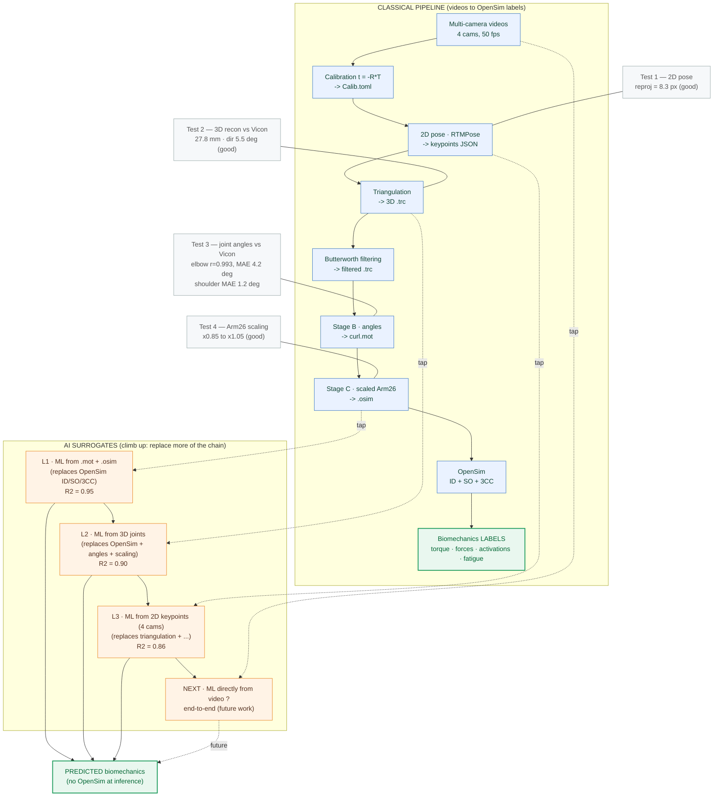

# Pipeline — Vision → OpenSim labels (descendant) + AI surrogates (montant)

## How to read it
- **Left / descending** = the classical pipeline we built: videos -> calibration -> 2D pose -> triangulation -> filtering -> angles (.mot) -> scaled Arm26 (.osim) -> OpenSim (ID/SO/3CC) -> biomechanics **labels**. Each stage was **validated vs Vicon** (Tests 1-4).
- **Right / ascending** = the **AI part**. Each level taps the pipeline **higher up** and replaces **more** of the classical chain:
  - **L1 (0.95)** keeps .mot + .osim, replaces only the OpenSim computation.
  - **L2 (0.90)** drops OpenSim entirely, predicts from the **3D joints**.
  - **L3 (0.86)** drops triangulation too, predicts from the **2D keypoints**.
  - **Next** would predict **directly from the video** (true end-to-end).
- The trend **0.95 -> 0.90 -> 0.86** quantifies the accuracy cost of removing each classical step.
